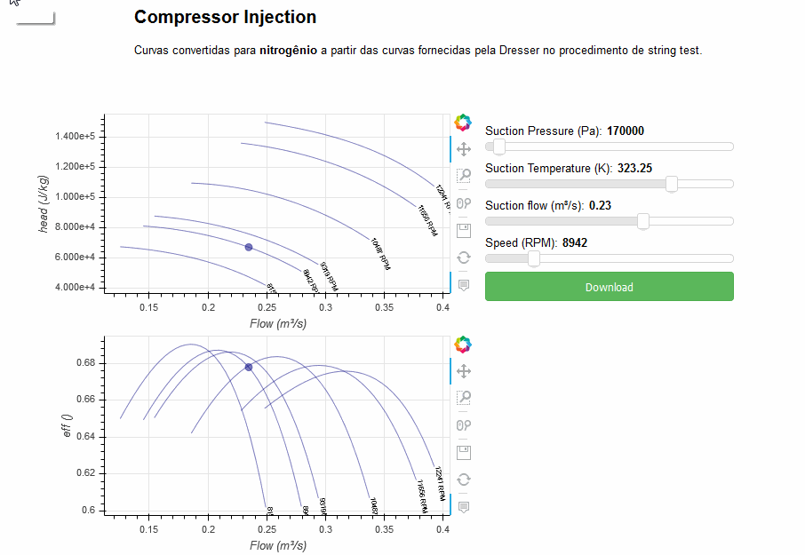

#  Centrifugal Compressor Performance

Biblioteca para cálculo de performance de compressores centrífugos em python.

# 

Para avaliação dos resultados também pode ser utilizada aplicação web que pode
ser disponibilizada através de recurso de núvem.



# Guia básico

Definição de estados termodinâmicos:

```python
fluid = {'CarbonDioxide': 0.8, 'R134a': 0.2}

#  Use pint quantity to define a value.
#  If a pint quantity is not provided, SI units are assumed.
ps = Q_(3, 'bar')
Ts = 300

#  Define suction and discharge states:
suc0 = State.define(fluid=fluid, p=ps, T=Ts)
disch0 = State.define(fluid=fluid, p=Q_(7.255, 'bar'), T=391.1)
```

Criar um ponto de operação:

```python
#  Create performance point(s):

point0 = Point(suc=suc0, disch=disch0, speed=Q_(7941, 'RPM'),
              flow_m=Q_(34203.6, 'kg/hr')
```

Criar curva e impelidor:

```python
#  Create a curve with the points:
curve = Curve(points)

#  Create an impeller that will hold and convert curves.
imp = Impeller(Curve, b=0.0285, D=0.365)
```
